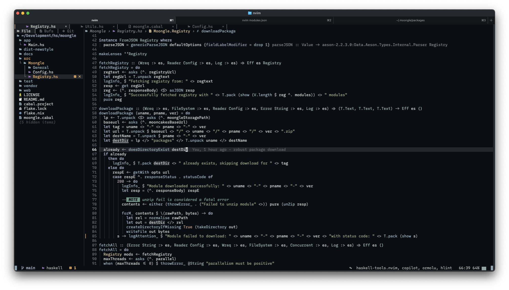

# kvim

<!--toc:start-->

- [My Neovim Config](#kvim)
  - [Introduction](#introduction)
  - [Dependencies](#dependencies)
  <!--toc:end-->

## Introduction

I write **Haskell**, Rust and Swift.

Here is the screenshot:

## Dependencies

- ghcup cabal hls ghc
- rustup cargo rustc
- sourcekit swiftlint swiftformat
- basedpyright ruff
- clangd
- lua-language-server
- marksman markdownlint prettierd prettier
- typst tinymist typstyle
